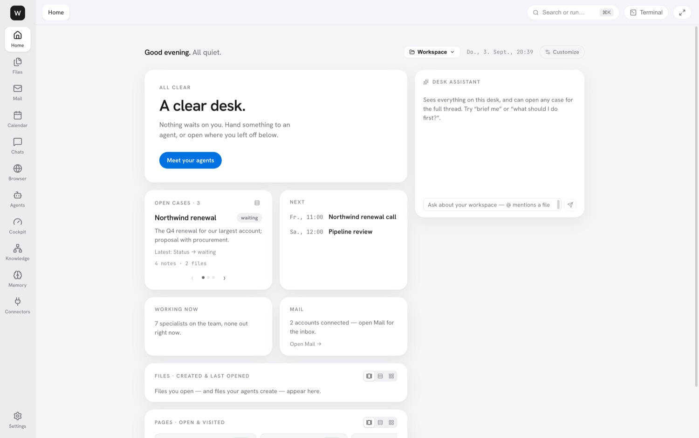
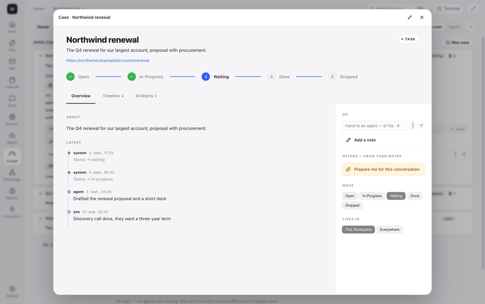

# Workspace OS

**The only workspace you will ever need.**

Workspace OS is a macOS desktop app that folds a manager's whole day into one window: real Word, Excel and PowerPoint files edited by an embedded LibreOffice engine, native mail and calendar, a full browser, notes with a knowledge graph, and AI agents that work inside the same folder you do, on your real files.

The benchmark we hold ourselves to: *a manager goes three consecutive days without opening any external application.*

> Screenshots below come from a seeded demo workspace. Names, companies and mail are fictitious.



## Why it exists

A manager's day is a constant context switch: mail here, budgets there, a deck somewhere else, a browser for research, and a separate AI tab for help. The tools themselves are fine. The fragmentation is the problem.

Workspace OS ends the fragmentation with two ideas that no single incumbent combines:

- **Live transclusion.** A number lives in one spreadsheet cell and flows true into every document, deck, email and note that quotes it. Change the source, and everything downstream follows. The file always holds a real literal, so it opens normally in any other office suite. A broken link shows a visible placeholder, never a wrong number.
- **The reviewable agent.** Every agent run starts with a checkpoint and lands as a card in a Living Feed with a diff, cost and turn count. You keep it or revert it in one click. Nothing is silently overwritten, and sending mail is always yours.

Everything is local-first and sovereign. Documents are ordinary Office files, cases are plain markdown, secrets live in the OS keychain, and the AI runs on your existing Claude Code subscription. No API key, no cloud dependency, no telemetry.

## What is in the window

The left rail holds twelve surfaces. `⌘K` searches or runs anything, `⌘P` opens any file, `⌘J` opens the terminal dock.

| Surface | What it does |
|---|---|
| **Home** | The hero names the one thing waiting on you or says the desk is clear. Cards for what happened while you were away, open cases, calendar, agents, files, mail and knowledge. A desk assistant takes plain language and `@` mentions files. |
| **Files** | The workspace tree with preview, create, trash and restore. Agents run inside this folder. |
| **Word documents** | Home, Insert, Layout, References, Review and View ribbons plus contextual Table and Picture tabs. The engine's own right-click menus and dialogs are rendered natively. Comments, tracked changes, ruler, watermark, PDF export, live metrics in text. Also `.doc`, `.odt`, and PDFs with annotation. |
| **Spreadsheets** | Formula bar, AutoSum, conditional formatting, data validation, find and replace, fill handle, AutoFilter, group and outline, a Formulas tab with wizard and auditing arrows, text to columns, goal seek, solver, scenarios. Any cell can become a live metric. Also `.xls`, `.ods` and CSV, which saves back in its own dialect. |
| **Presentations** | Slide rail with drag reorder, shapes with smart guides, slide tables, speaker notes, Transitions and Animations tabs, Sorter and Outline views, reusable Components, Present mode. Any shape can become a live metric. |
| **Notes and code** | Markdown with Edit, Split and Preview, `[[wikilinks]]`, live transclusions in the preview, an infinite `.wcanvas` canvas, HTML preview. |
| **Mail** | Native IMAP and SMTP, multiple accounts, undo send, signatures. **Sift** sorts the inbox into zones (needs a reply, your cases, worth a glance, noise) and learns permanent sender rules from one correction. **Triage** proposes filing, **Newsletters** sweeps subscriptions. Rich compose with blocks, brand kit, live metrics and live tables. Agents draft, you send. |
| **Calendar** | Day, week and month views, drag to reschedule, surgical edits that preserve attendees and alarms, recurring series. CalDAV read and write for iCloud, Fastmail and Nextcloud, local `.ics`, subscribed feeds. An Ask box takes plain language. |
| **Browser** | Tabs and tab groups, bookmarks, history, session restore, a page assistant, and **Deep-read this site**. Agents navigate, click, type, extract and screenshot; research fans out one tab per helper. |
| **Agents** | **Team** lists specialists with an access level and a Run button; the **Foundry** builds a new one from a sentence. **Feed** is the Living Feed. **Fleet** shows one lane per running assistant with batched approval. |
| **Cockpit** | **Home** (Needs you, Working, Landed), **Stream** (one sentence per event by day, with per-day run cost) and **Map** (cases as territories holding their documents and live values). Altitudes for head-of and team-lead views. |
| **Knowledge, Memory, Connectors, Settings** | Backlinks and a graph over your notes. Durable facts, decisions and preferences that agents read before every run, split into workspace and personal. One row per connected service with an honest description of the mechanism. Appearance, agent mode, default file format, brand kit, engine status. |

### Cases and routines

A **case** is the unit of work that outlives one agent run: stages, a notes timeline, attached files, mail and dates, stored as one markdown file under `Cases/` that reads fine without the app. Notes imply offers that show up as one-tap suggestions, and `#case` in the prompt bar hands work to an agent.

**Routines** are scheduled agents the app owns: daily, weekday, weekly or every few hours, with exactly the capabilities you grant. They run in safe mode, survive the window closing, catch up once after a missed run and never stack. Three ship switched off: Morning sift, Weekly case report, Stale case check.

### The terminal dock and agent commands

`⌘J` opens a dock with shell tabs and agent tabs. Agent tabs run Claude Code (or Codex) with a live harness: the workspace root, the surface you are on, the open file and that surface's actions. Every run's PATH carries these commands:

| Command | Purpose |
|---|---|
| `wos-gen` | Generate a real `.pptx`, `.xlsx` or `.docx` from a JSON spec |
| `wos-metric` | Read, update and propagate live metrics and ranges |
| `wos-collection` | Live typed record sets projected into office files as synced tables |
| `wos-case` | Create and update cases as markdown |
| `wos-action` | Drive surface actions through a token-gated bridge, never destructive |
| `wos-mcp-token` | Mint bearer headers for connectors from the keychain |



## Install

Releases are published on this repository's Releases page. The current beta is a pre-release.

1. Download `Workspace.OS-<version>-arm64.dmg` from the latest release. Builds are Apple Silicon only.
2. Open the dmg and drag Workspace OS to Applications.
3. The app is ad-hoc signed and not notarized, so Gatekeeper blocks the first launch. Either right-click the app and choose Open, or run once:

```sh
xattr -dr com.apple.quarantine "/Applications/Workspace OS.app"
```

4. Install [Claude Code](https://docs.anthropic.com/claude-code) and sign in. The app finds `claude` on your PATH and runs agents on your subscription. Codex is optional and found the same way.
5. Document generation needs a system `python3`. On first use the app creates its own virtual environment and installs `python-pptx`, `openpyxl` and `python-docx` into it.

The office engine is bundled inside the app (about 650 MB of LibreOffice), so documents work with nothing else installed. Installed size is about 1.3 GB.

On first launch, choose a folder. That folder is the workspace: every file operation is confined to it, agents run inside it, and the app's own state lives in a `.workspace-os/` subfolder (checkpoints, trash, memory). App-wide state lives in `~/Library/Application Support/workspace-os`.

## Keyboard

| Keys | Does |
|---|---|
| `⌘K` | Search or run |
| `⌘P` | Go to file |
| `⇧⌘F` | Search in files |
| `⌘J` · `⌥⌘J` | Terminal dock: toggle · minimise |
| `⌘⇧A` | Focus the agent |
| `⌘B` | Hide the rail |
| `⌘W` · `⇧⌘]` · `⇧⌘[` | Close tab · next · previous |
| `⌃⌘F` | Fill the window (Esc leaves) |
| `⌘O` · `⇧⌘W` | Open folder · close folder |
| `⌘⇧B` | Report a bug |

The full manual with screenshots of every surface is at [docs/manual/workspace-os-manual.html](docs/manual/workspace-os-manual.html).

## Status

Version 0.1.125, September 2026. Shipped and green in automated tests: everything in the table above. Known gaps, in the manual's own words:

- **Chats** is a placeholder. Team chat is the last channel standing between the app and the three-day benchmark.
- Gmail, Google Drive and Google Calendar write paths wait on a Google client id. Google and Microsoft calendars are read-only today.
- The Cockpit CEO altitude is a preview on mock data. Workspace Apps are a blueprint.
- Calendar has no agenda list or event search and cannot author new recurrence rules.
- Image generation is not built.
- Memory retrieval is lexical, not semantic.
- macOS only. Windows and Linux targets are declared in the builder config but have never been built and would ship without the office engine.
- Not signed with a Developer ID and not notarized.

Planned next, per the roadmap: freeze panes and pivot tables, mail-merge from a Collection, Word comments in the Living Feed, slide master editing, mail threading and search, a messages surface, semantic memory search, and beta accounts with report collection.

Explicitly not building: real-time multiplayer, a from-scratch office engine, commodity features without liveness or agent leverage, or any mandatory cloud dependency.

## Security posture

- All fourteen items of the Electron security checklist are enforced: no node integration, context isolation, process sandbox, deny-by-default permissions, CSP via response headers, no webview tag, off-app navigation blocked and opened in the system browser.
- The main process owns the workspace root. Every file IPC validates the path lexically and through symlink resolution, so a compromised renderer cannot escape the chosen folder.
- Every IPC handler takes untyped input and validates it. A newline in a path is rejected because it would inject a line into the engine protocol.
- Agents and the engine are spawned with array arguments, never through a shell. The prompt goes to stdin, never argv. Agent permissions are scoped allow and deny lists; there is no bypass mode.
- Each agent run gets a per-run token and a grant of surfaces it may drive through the action bridge. Anything outside the grant is refused and logged.
- Secrets are stored only as ciphertext through the OS keychain, and the vault refuses to write if secure storage is unavailable. A decrypted secret reaches a child process only at spawn time, through the environment, and is dropped from memory right after.
- Destructive file operations move the prior version to `.workspace-os/trash` first. A shadow git repository under `.workspace-os/checkpoints` snapshots the tree before every agent run.

See [SECURITY.md](SECURITY.md) for the file-by-file map. Two passages there predate the LibreOffice engine and still describe an OnlyOffice path that no longer exists.

## Development

### Prerequisites

- macOS on Apple Silicon. The build, the engine sidecar and the ship script are darwin only.
- Node 22 or newer (24 is known good). No version file is pinned.
- Python 3 on the PATH for document generation.
- Claude Code installed and signed in. Codex optionally.
- The patched LibreOffice engine build mounted at `/Volumes/LOBuild`. It is not in this repository: it is built from `scripts/lok/build-headless-macos.sh` with the patches in `scripts/lok/*.patch`, and the sidecar from `scripts/lok/build-host.sh`. Without it, the app runs but office documents do not render.

```sh
hdiutil attach "/Volumes/Extreme SSD/LOBuild.sparseimage"
```

### Everyday commands

```sh
npm install
npm run rebuild:electron   # native modules for the Electron ABI, then ad-hoc re-sign
npm run dev                # electron-vite dev server

npm run rebuild:node       # native modules back to the Node ABI
npm test                   # vitest, 238 files / 2893 tests, about 6 s
npm run typecheck          # regression-gated tsc over both tsconfigs
npm run lint

npm run dist:mac           # package dmg + zip into release/
npm run ship               # typecheck, test, bump, build, install, launch, release
```

Two rules that cost real sessions to learn:

- **`better-sqlite3` and `node-pty` build for one ABI at a time.** Run `rebuild:electron` before `dev`, packaging or any Playwright test, and `rebuild:node` before `vitest`. Every `e2e:*` script flips to Electron and back automatically. `ERR_DLOPEN_FAILED` in the unit suite means you are still on the Electron ABI.
- **Rebuilt native modules must be re-signed.** Both rebuild scripts call `scripts/sign-native.mjs`, which ad-hoc signs the `.node` binaries and verifies the seal. Without it macOS kills the process at the first `dlopen`, which shows up as "the app keeps crashing" or "Playwright cannot launch Electron".

`npm run typecheck` runs `scripts/typecheck.mjs` rather than plain `tsc`, because the root tsconfig has an empty file list and would pass on a tree full of errors. The script tallies errors per file and code and fails only when a count exceeds `scripts/typecheck-baseline.json`. Lower the baseline with `npm run typecheck -- --accept` when you fix errors.

`npm test` first runs `scripts/validate-macros.mjs`, which checks the StarBasic module seeded into the engine without booting LibreOffice. A reserved word or an unescaped `<` there silently kills the whole macro module at runtime.

### Real-engine end-to-end tests

Office and engine work is only done when a test boots the real app with the real LibreOffice engine, drives an actual control, and asserts on canvas pixels or the saved file. Unit tests and `ok: true` replies have passed on empty charts and dead macros. The suites live in `e2e/office/`, one letter per function area from `A-ribbon` to `AU-sort-expand`, and run through the `e2e:*` scripts (`e2e:office`, `e2e:transclusion`, `e2e:parity`, `e2e:charts`, and so on). `WOS_SUITE_ENGINE=bundled` forces the packaged engine, and `WOS_E2E_SHELL=legacy` drives the classic layout instead of the default shell. Screenshots land in `e2e/office/shots/`.

The harness is flaky about one run in three because of the app's single-instance lock, so `npm run ship` warns on e2e results rather than gating on them. Run the relevant suite yourself for engine work.

### Shipping

`npm run ship` refuses to run on uncommitted source, verifies typecheck and tests (with exactly one retry for a documented sidecar flake, reported loudly), bumps the patch version so the in-app updater sees an upgrade, packages, verifies the code signature twice, installs to `/Applications`, launches, pushes, tags and creates the GitHub release with the dmg and zip. Flags: `--dry-run`, `--no-release`, `--no-install`, `--no-launch`, `--no-bump`, `--notes`.

### Layout

```
src/main/          Electron main process, one module or folder per bounded context
  agent/           launching Claude Code and Codex, the action bridge, grants, the Foundry
  office/          LibreOfficeKit engine host, macros, CSV sniffing, clipboard
  mail/ calendar/ browser/ drive/ mcp/ memory/ routines/ runs/ search/ secrets/ terminal/
  cases.ts collections.ts metrics.ts ranges.ts transclusions.ts   the liveness layer
  handlers/        forty registerXHandlers modules, the seam between IPC channels and domains
  ipc-channels.ts ipc-registry.ts ipc-validator.ts   the single channel table and its validation
src/preload/       one contextBridge file, emitted as CommonJS for the sandbox
src/renderer/src/  React 18, no store library; components/Shell holds the rail and the shell model
src/shared/        types shared by main and renderer
resources/         the bundled CLIs and the two in-app skills (office-docgen, office-component)
scripts/lok/       engine patches, build scripts and the wos-lok-host sidecar source
e2e/               Playwright and CLI end-to-end suites
docs/              manual, blueprints, roadmap, handoff notes
```

The engine is a separate process. `src/main/office/lokHost.ts` spawns `wos-lok-host`, a small C++ sidecar that links LibreOfficeKit, and speaks a line protocol to it: one command in, a length-prefixed JSON reply, tile or callback out. At build time `package.json` copies the patched `LibreOffice.app` and the sidecar into the bundle's resources, and `scripts/after-pack.cjs` re-signs the whole app before the dmg is made.

### Where data lives

| Location | Contents |
|---|---|
| `<workspace>/Cases/*.md` | Cases, plain markdown |
| `<workspace>/.workspace-os/` | Checkpoints (shadow git), trash, workspace memory database |
| `~/Library/Application Support/workspace-os/` | Workspace root and recents, live metrics and ranges, collections, routines, run queue, brand kit, encrypted secrets, search and mail indexes, personal memory, the CLI shims in `bin/`, the Python venv in `pyenv/` |

Workspace memory and personal memory are separate databases on purpose, so a workspace can be copied, shared or deleted without carrying personal preferences along.

## Documents worth reading

- [docs/manual/workspace-os-manual.html](docs/manual/workspace-os-manual.html), the user manual, authoritative for the shipped UI
- [docs/WORKSPACE-OS.md](docs/WORKSPACE-OS.md), the idea, the six principles and the story so far
- [docs/blueprints/product-roadmap.md](docs/blueprints/product-roadmap.md), shipped versus planned per surface
- [docs/blueprints/beta-readiness.md](docs/blueprints/beta-readiness.md), accounts and report collection for a first beta
- [docs/TESTING-GUIDE.md](docs/TESTING-GUIDE.md), the ten-minute human dogfood script
- [SECURITY.md](SECURITY.md), the security posture file by file

## License

MIT. See [LICENSE](LICENSE).

Third-party components ship with their own terms:

- The bundled office engine is LibreOffice, licensed under the Mozilla Public License 2.0. Its license and notices are inside the app bundle, and the patches applied to it are in `scripts/lok/`.
- The infinite canvas is tldraw, which uses its own license and requires its watermark to stay unless you hold a tldraw business license.
- Fonts are under the SIL Open Font License. Everything else is MIT, Apache-2.0, BSD or ISC.
